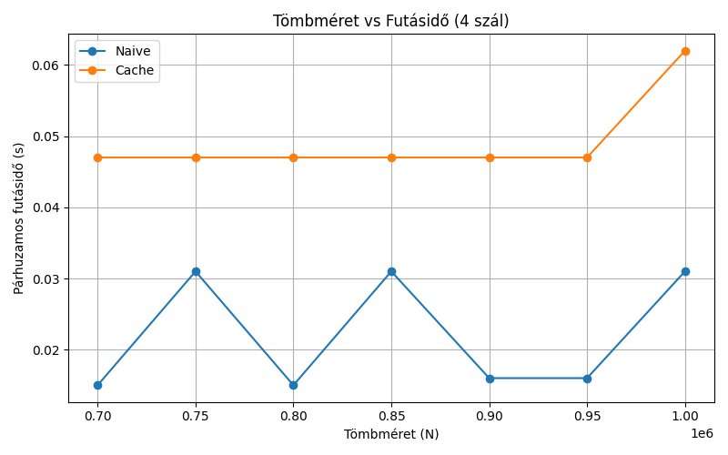
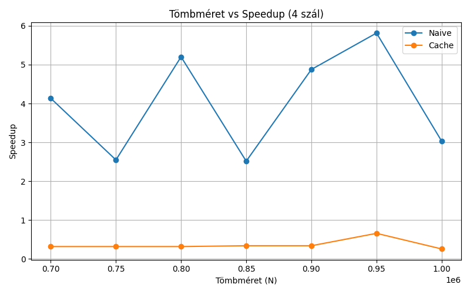

# Fibonacci Leképezés Tömbre – Eredmények

## Futásidő a problémaméret függvényében (4 szál)

**Megfigyelés:**  
Mindkét görbe közel lineáris növekedést mutat a tömbméret (N) emelkedésével, ami azt tükrözi, hogy minden további elem újabb Fibonacci-számítást igényel. Ugyanakkor a **cache-es** verzió meredeksége jóval alacsonyabb, azaz minden N-re rövidebb idő alatt végez, mint a **naive** (iteratív) implementáció.

**Elemzés:**  
A memoizációs változatnál egyszer kiszámolt Fibonacci-értékek a globális `fib_cache`-ben tárolódnak, és több kérésnél újrahasznosulnak. Ennek köszönhetően a cache-es implementáció overhead-je viszonylag konstans, míg a naive verzió minden egyes hívásnál végigfutja az iterációs ciklust.

**Következtetés:**  
Nagyobb tömbméretek esetén a cache használata egyre nagyobb előnyt jelent: míg a naive algoritmus futásideje egyenesen arányos N-nel, a cache-es verzió effektív komplexitása jelentősen alacsonyabb, mert elkerüli a felesleges újraszámolásokat.

---

## Szálak száma vs. Futásidő (N = 100 000)

**Megfigyelés:**  
Mindkét görbe eleinte gyors csökkenést mutat az 1→4 szál skálázás során, de 8 szálnál már érezhető telítődés, 16 szál esetén pedig alig javul (sőt a naive verziónál overhead miatt akár nő is a futásidő).

**Elemzés:**  
A párhuzamosítás előnyei a szálak számával kezdetben növekednek, de amint a CPU-cache verseny és a kritikus szakaszok miatti várakozás dominál, a speedup lelassul. A cache-es változat jobban skálázódik, mert kevesebb rekurzív hívást igényel, de nála is megjelenik a párhuzamos overhead határa.

**Következtetés:**  
Érdemes 4–8 szál környékén megtalálni az optimális pontot: ekkor a legjobb az arány futásidő-szálak között. 8–16 szál fölött a szinkronizációs és cache-kezelési költségek már csökkentik a párhuzamosítás hozamát, így túl sok szál alkalmazása nem jár további jelentős gyorsulással.

