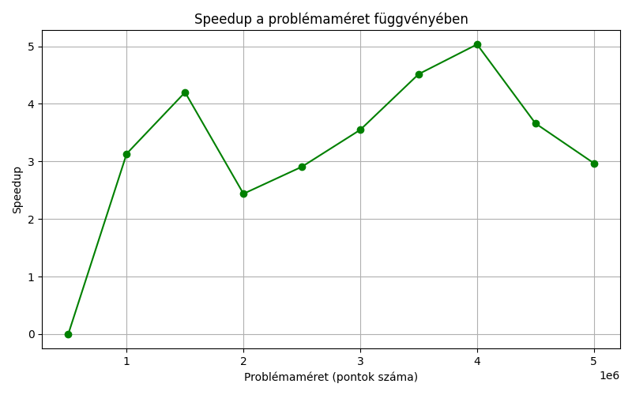

# Monte Carlo Szimuláció - Eredmények

## Futásidő a problémaméret függvényében

Megfigyelés: A grafikonon a probléma növekvő méretével a futásidő egyértelműen növekszik. Ez várható, mivel a Monte Carlo szimuláció futtatása több pontot igényel, ami hosszabb számítási időt eredményez.

Szekvenciális vs Párhuzamos: A párhuzamos algoritmus gyorsabbnak tűnik, mivel a számítási terhelést több szál között osztja el. Ahogy a problémaméret nő, a szekvenciális algoritmus futásideje exponenciálisan nő, míg a párhuzamos algoritmus viszonylag alacsonyabb futásidőt mutat.

Következtetés: A párhuzamosítás képes jelentősen csökkenteni a futásidőt nagy problémaméret esetén, különösen, ha a rendelkezésre álló számítási egységek száma is nő.
## Speedup a problémaméret függvényében

Megfigyelés: A speedup (gyorsulás) grafikonja azt mutatja, hogy a párhuzamos algoritmus gyorsabbá válik a szekvenciálishoz képest, ahogy a problémaméret növekszik. A speedup a párhuzamos algoritmus hatékonyságát mutatja, és ideálisan a számítási egységek számával arányosan növekednie kellene.

Következtetés: A speedup nem lineáris, és kezdetben kisebb problémaméreteknél nem figyelhető meg jelentős gyorsulás. Azonban ahogy a probléma mérete nő, a speedup is jelentősen növekszik. Ez alátámasztja, hogy nagyobb problémaméreteknél a párhuzamosítás sokkal inkább előnyös, és lehetővé teszi a gyorsabb számításokat.
## Hatékonyság a problémaméret függvényében

Megfigyelés: Az efficiency (hatékonyság) grafikonja a párhuzamos számítások hatékonyságát mutatja a rendelkezésre álló szálak számával kapcsolatban. Ahogy több szálat használunk, az efficiency csökkenhet, mivel a párhuzamosítás költségekkel jár (pl. szinkronizációs költségek).

Következtetés: Az efficiency nem nő a szálak számának növelésével, hanem csökkenhet, ha túl sok szálat használunk. Ez azt jelzi, hogy a szálak számának növelésével nem mindig érjük el az optimális teljesítményt. A túl sok szál túlterhelheti az erőforrásokat és a szinkronizációs költségek is nőhetnek.