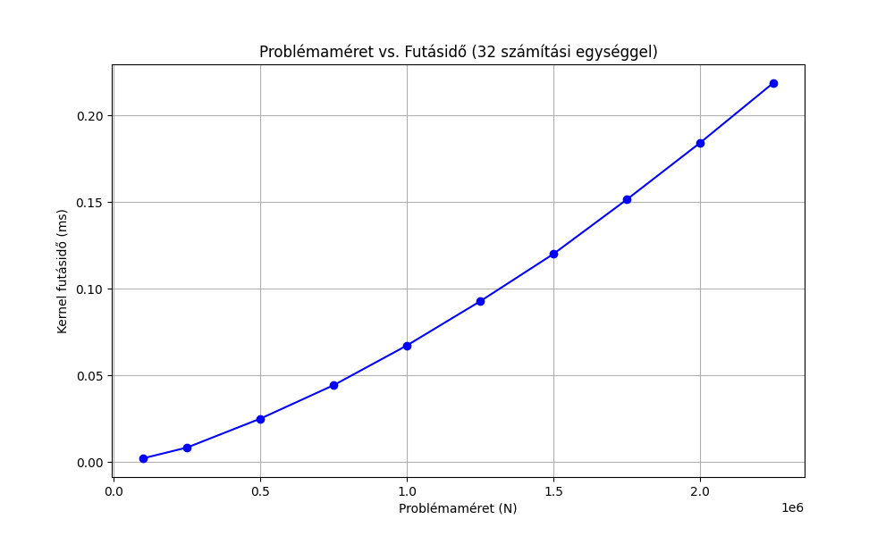
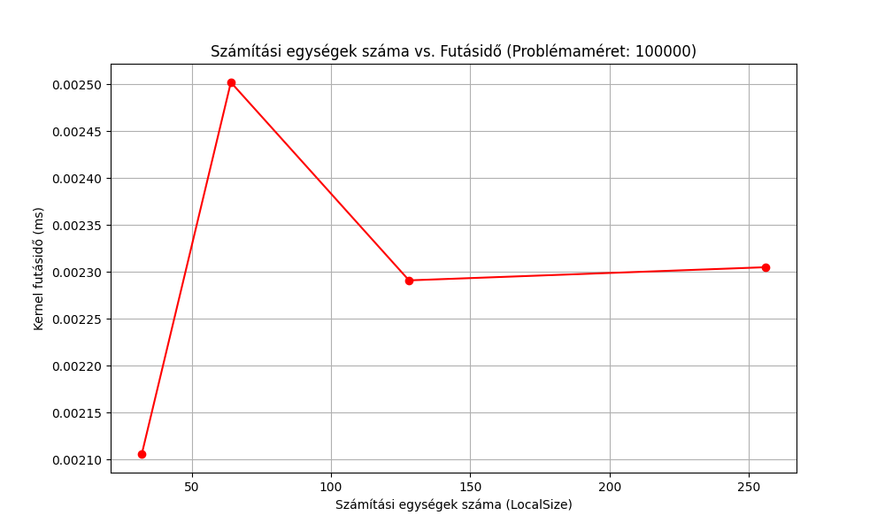

# Prime Numbers OpenCL Benchmark

Ez a projekt az OpenCL használatával párhuzamosan számolja ki a prímszámokat különböző problémaméretek és számítási egységek mellett, és elemzi a futásidőket. A cél a párhuzamos számítások teljesítményének mérésére és optimalizálására vonatkozó megfigyelések összegyűjtése.

## A projekt célja

A projekt célja, hogy bemutassa, hogyan változik a futásidő a probléma méretének és a számítási egységek számának függvényében. Különböző memóriakezelési módszereket és párhuzamosítási technikákat használtunk annak érdekében, hogy kiemeljük a különböző implementációk közötti különbségeket.

## Grafikonok

Az alábbiakban két grafikon található, amelyek bemutatják a különböző paraméterek (problémaméret és számítási egységek száma) hatását a futásidőre.

### 1. Problémaméret növelésével hogyan változik a futásidő adott számú számítási egység mellett

#### 

**Megfigyelés:**  
A futásidő növekvő problémaméret (N) esetén lineáris növekedést mutat, mivel a nagyobb problémák több számítási műveletet igényelnek. A különbségek a cache-es és a nem cache-es verziók között nem olyan markánsak, mivel a memória-hozzáférés már nem dominál.

**Elemzés:**  
A grafikonon jól látszik, hogy az egyre nagyobb problémaméreteknél, ha növeljük a számítási egységek számát, akkor a futásidő is lineárisan nő. A cache-es verzióknál viszont az egyes lépések között érezhetően kisebb a növekedés a memóriahasználat hatékonyságának javulása miatt.

**Következtetés:**  
A növekvő problémaméret következtében a futásidő emelkedése, ha az alkalmazott számítási egységek száma nem elegendő, egyre inkább csökkenti a párhuzamosítás hatékonyságát. Ugyanakkor a cache-es megoldásoknál ez a növekedés valamelyest kompenzálható, hiszen az adatok újrahasználata csökkenti a szükséges számítások számát.

---

### 2. Adott méretű probléma esetén hogyan változik a futásidő a számítási egységek számának növelésével

#### 

**Megfigyelés:**  
A grafikonon látható, hogy a szálak számának növelése kezdetben a futásidő gyors csökkenését eredményezi, de 8 szál után a növekedés már lassul. 16 szálnál pedig a futásidő akár növekedhet is a párhuzamosítási overhead miatt.

**Elemzés:**  
A futásidő csökkenése a szálak számának növekedésével részben a párhuzamosítás hatékonyságának javulásából adódik. Azonban 8 szál környékén kezd beütni a CPU-cache verseny, amely a további szálak növelését már nem kíséri megfelelő gyorsulás, sőt, overheadet is okozhat, amely meghosszabbítja a futásidőt.

**Következtetés:**  
Az optimális párhuzamosítási pont 4-8 szál között található, mivel ezen a ponton a legjobb a szálakhoz rendelt futásidő-arány.